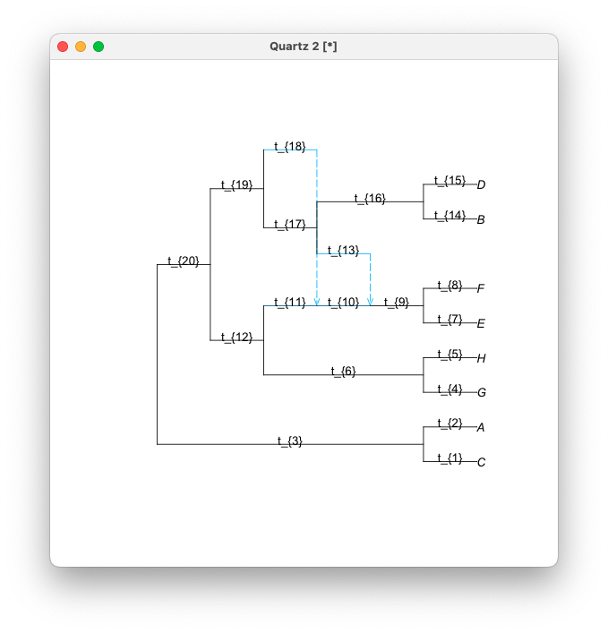

# SymbolicQuartetNetworkCoal.jl

Aloha!

`SymbolicQuartetNetworkCoal.jl` is a Julia package that provides useful functions to study identifiability of phylogenetic trees and networks using quartet concordance factors with techniques from algebraic statistics. This package is constructed by extending another Julia package `QuartetNetworkGoodnessFit`, aka "Quarnet GoF" or simply "QGoF" (https://github.com/JuliaPhylo/QuartetNetworkGoodnessFit.jl).

## Installation

Install with the Julia package manager [Pkg](https://pkgdocs.julialang.org/), just like any other registered Julia package (**Below will be on once the package registered. Is you see this, it is not registered yet.**):
```@julia
pkg> add SymbolicQuartetNetworkCoal  # Press ']' to enter the Pkg REPL mode.
```
or
```@julia
julia> using Pkg; Pkg.add("SymbolicQuartetNetworkCoal")
```
To make sure the package is installed correctly, try the following:
```@julia
julia> using SymbolicQuartetNetworkCoal

julia> aloha()

⠀⠀⠀⠀⠀⠀⠀⠀⠀⠀⠀⠀⠀⠀⠀⠀⠀⠀⠀⣀⣠⣤⣴⠂⢀⡀⠀⢀⣤⣀⠀⠀⠀⠀⠀⠀⠀⠀⠀⠀⠀⠀⠀⠀⠀⠀
⠀⠀⠀⠀⠀⠀⠀⠀⠀⠀⠀⠀⣤⣤⣄⣠⣀⠀⠘⠋⠉⠉⠁⠀⠺⣿⡷⣿⣿⣿⡿⠀⢀⡀⠀⠀⠀⠀⠀⠀⠀⠀⠀⠀⠀⠀
⠀⠀⠀⠀⠀⠀⠀⠀⠀⠀⠀⣠⣿⣿⣛⠛⠉⠀⠀⠀⠀⠺⣷⣦⠀⠀⠀⠙⠛⠉⠀⠀⠈⣿⣦⣤⣄⠀⠀⠀⠀⠀⠀⠀⠀⠀
⠀⠀⠀⠀⠀⠀⠀⢀⣴⣿⣆⠀⠈⠉⠁⠀⠀⠀⠀⠀⠀⠀⠙⠉⠀⠀⢸⣦⠀⠀⠀⢀⣼⣿⣿⣿⣿⣷⡄⠀⠀⠀⠀⠀⠀⠀
⠀⠀⠀⠀⠀⠀⠀⢺⣿⣿⡿⠁⠀⠀⠀⠀⠀⠀⠀⠀⠀⠀⠀⠀⠀⠀⠀⠀⠀⠀⠀⢻⣿⣿⣿⣿⣿⣿⣧⡀⠀⠀⠀⠀⠀⠀
⠀⠀⠀⠀⠀⢀⡆⠈⠁⠀⠀⠀⠀⠀⠀⠀⠀⠀⠀⢀⣠⣤⣤⣀⠀⠀⠀⠀⠀⠀⠀⠘⣿⣿⣿⣿⣿⣿⣿⣷⠄⠀⠀⠀⠀⠀
⢠⣾⣷⣦⡀⠘⠇⠀⠀⠀⠀⠀⠀⠀⠀⠀⠀⠀⣰⣿⣿⣿⣿⣿⣷⣦⡀⠀⠀⠀⠀⢠⣿⣿⣿⡿⠟⠛⠋⠁⣀⣠⣤⣄⣀⠀
⠘⣿⣿⣿⣷⣄⠀⠀⠀⠀⠀⠀⠀⠀⢠⣴⣾⣶⣿⣿⣿⣿⣿⣿⣟⠘⣿⣷⡀⠀⠀⠘⠿⡿⠉⠀⠀⣀⣴⣾⣿⣿⣿⣿⡿⡂
⠀⠈⠿⢟⣿⣿⣆⠀⠀⠀⠀⢀⣤⣤⣿⣿⣿⣿⣿⣎⠛⢫⣿⣿⣿⣷⡘⢿⣿⣆⠀⠀⠀⠀⠀⢀⣾⣿⣿⣿⣿⣿⡿⠛⠋⠁
⠀⠀⠀⢺⣿⣿⣿⣷⡄⠀⢰⣿⣿⣿⣯⠹⣿⣿⣿⣷⣶⡜⢿⣿⣿⣿⣷⡄⠹⣿⣷⣄⠀⠀⣴⣼⣿⣿⣿⣿⠟⠉⠀⠀⠀⠀
⠀⠀⠀⠀⠙⢻⣿⣿⣿⣦⡘⢿⣿⣿⣿⣃⠉⢿⣿⣿⣿⣿⡌⢻⣝⠻⠿⢃⡀⣿⣿⣿⣷⣶⣿⣿⣿⣿⡿⠃⠀⠀⠀⠀⠀⠀
⠀⠀⠀⠀⠀⠀⢻⣿⣿⣿⣷⣄⠛⣿⣿⣿⣿⣄⠻⣿⣿⣿⣿⡆⠙⠷⠶⠟⢠⣿⣿⣿⣿⣿⣿⣿⣿⡟⠁⠀⠀⠀⠀⠀⠀⠀
⠀⠀⠀⠀⠀⠀⠀⠙⢿⣿⣿⣿⡇⠈⠻⣿⣿⣿⣷⠘⠧⣉⣁⡴⠀⢠⣤⣶⣿⣿⣿⣿⣿⣿⣿⣿⡟⠀⠀⠀⠀⠀⠀⠀⠀⠀
⠀⠀⠀⠀⠀⠀⠀⠀⠈⢿⣿⣿⣿⣷⣄⠙⠧⣍⣩⡜⢀⣀⣀⠄⣴⣿⣿⣿⣿⣿⣿⣿⣿⣿⣿⠏⠀⠀⠀⠀⠀⠀⠀⠀⠀⠀
⠀⠀⠀⠀⠀⠀⠀⠀⠀⠈⢿⣿⣿⣿⣿⣷⣦⣄⣀⣤⣾⣿⣿⣼⣿⣿⣿⣿⣿⣿⣿⣿⣿⣿⠏⠀⠀⠀⠀⠀⠀⠀⠀⠀⠀⠀
⠀⠀⠀⠀⠀⠀⠀⠀⠀⠀⠀⠻⣿⣿⣿⣿⣿⣿⣿⣿⣿⣿⣿⣿⣿⣿⣿⣿⣿⣿⣿⣿⡿⠋⠀⠀⠀⠀⠀⠀⠀⠀⠀⠀⠀⠀
⠀⠀⠀⠀⠀⠀⠀⠀⠀⠀⠀⠀⠈⠻⢿⣿⣿⣿⣿⣿⣿⣿⣿⣿⣿⣿⣿⣿⣿⣿⠿⠋⠀⠀⠀⠀⠀⠀⠀⠀⠀⠀⠀⠀⠀⠀
⠀⠀⠀⠀⠀⠀⠀⠀⠀⠀⠀⠀⠀⠀⠀⠈⠉⠛⠛⠻⠛⠛⠁⠉⠙⠛⠉⠉⠉⠀⠀⠀⠀ Hawai'i-Five-O
```
You should be able to see the Shaka! 

## Input and output
  - **Input**: A network topology (with four or more taxa) written in extended Newick format, with or without parameters specified.
  - **Output**: Numerical or symbolic formulas to compute the quartet concordance factors (CFs) under the network multispecies coalescent for each quartet topology extracted from the input network.
  
## Main functions
### Full parametrized topology with random values

The function `readTopologyrand()` topology imports a (extended) Newick string or a text file that contains a (extended) Newick string in the first line and assigns randomized edge lengths and inheritance probabilities. It results in a non-ultrametric topology. This function is useful when the parameters in the given topology is not or partially available, as we need fully parametrized topologies to obtain the set of formulas.

Briefly, n^th edge that appears in the Newick topology will have the length of n plus a random value drawn from the uniform distribution of U(0,1). The depth of the entire topology can controlled using the optional argument `scaleparameter` that multiplies the generated edge lengths to the specified value. The default value of `scaleparameter` is one. The inheritance probability is drawn from the uniform distribution of U(0,1).

```@julia
julia> ik1=SymbolicQuartetNetworkCoal.readTopologyrand("((C,A),(((G,H),(((E,F))#H2)#H1),((#H2,(B,D)),#H1)));")
PhyloNetworks.HybridNetwork, Rooted Network
20 edges
19 nodes: 8 tips, 2 hybrid nodes, 9 internal tree nodes.
tip labels: C, A, G, H, ...
((C:1.447,A:2.341):3.512,(((G:4.325,H:5.036):6.06,(((E:7.226,F:8.802):9.386)#H2:10.989::0.509)#H1:11.467::0.889):12.585,((#H2:13.222::0.491,(B:14.527,D:15.871):16.692):17.377,#H1:18.815::0.111):19.026):20.727);

julia> ik1=SymbolicQuartetNetworkCoal.readTopologyrand("((C,A),(((G,H),(((E,F))#H2)#H1),((#H2,(B,D)),#H1)));",scaleparameter=0.1)
PhyloNetworks.HybridNetwork, Rooted Network
20 edges
19 nodes: 8 tips, 2 hybrid nodes, 9 internal tree nodes.
tip labels: C, A, G, H, ...
((C:0.164,A:0.282):0.307,(((G:0.415,H:0.561):0.657,(((E:0.713,F:0.89):0.944)#H2:1.046::0.634)#H1:1.102::0.813):1.23,((#H2:1.393::0.366,(B:1.435,D:1.595):1.63):1.767,#H1:1.83::0.187):1.995):2.023);
```
Notice the edge lengths of the bottom network is roughly 1/10 of the top network since we set `scaleparameter=0.1`.

### Formulas for expected quartet CFs

The function `network_expectedCF_formulas` is the core function that produces the quartet CFs for each quartet in the input topology. When this function is executed *only* with the network topology provided (i.e., without specifying any of the optional arguments), it performs the identical procedure as `network_expectedCF` function in `QuartetNetworkGoodnessFit`. The arguments that can be specified to perform the functions available in `SymbolicQuartetNetworkCoal` are:

#### Mandatory argument
  - Network topology written in Newick 

#### Optional arguments
  - `showprogressbar(=false [default])`
  - `inheritancecorrelation(=0 [default])`
  - `filename(=""symbolicQNC-HFO-out" [default])`
  - `symbolic(=false [default])`
  - `savecsv(=false [default])`
  - `macaulay(=false [default])`
  - `matlab(=false [default])`

#### Numerical formulas

The function 

```@julia
julia> network_expectedCF_formulas(ik1,inheritancecorrelation=0)```

```
SymbolicQuartetNetworkCoal.jl log
Timestamp: 2025-02-24T18:45:18.762
------------------------
General setting: 
Symbolic option: off
Store output in .csv file: off
Write Matlab file: off
Write Macaulay2 file: off
------------------------
Topology:
((C:1.85113,A:2.4774289):3.5732234,(((G:4.2852874,H:5.1839555):6.9904621,(((E:7.0906201,F:8.5153955):9.0431873)#H2:10.4526595::0.1021757)#H1:11.0652352::0.7983348):12.2439055,((#H2:13.0069595::0.8978243,(B:14.8312632,D:15.7456604):16.0949443):17.4547141,#H1:18.3397273::0.2016652):19.5821649):20.5231182);
((C:t_{1},A:t_{2}):t_{3},(((G:t_{4},H:t_{5}):t_{6},(((E:t_{7},F:t_{8}):t_{9})#H2:t_{10}::r_{1})#H1:11-&rho652352::r_{2}):t_{12},((#H2:t_{13}::(1-r_{1}),(B:t_{14},D:t_{15}):t_{16}):t_{17},#H1:t_{18}::(1-r_{2})):t_{19}):t_{20});
------------------------
Parameters:
Parameter		Value
t_{1}		1.85113
t_{2}		2.4774289
t_{3}		3.5732234
t_{4}		4.2852874
t_{5}		5.1839555
t_{6}		6.9904621
t_{7}		7.0906201
t_{8}		8.5153955
t_{9}		9.0431873
t_{10}		10.4526595
r_{1}		0.1021757
t_{11}		11.0652352
r_{2}		0.7983348
t_{12}		12.2439055
t_{13}		13.0069595
(1-r_{1})		0.8978243
t_{14}		14.8312632
t_{15}		15.7456604
t_{16}		16.0949443
t_{17}		17.4547141
t_{18}		18.3397273
(1-r_{2})		0.2016652
t_{19}		19.5821649
t_{20}		20.5231182
&rho		0
------------------------
Concordance factor:
Quartet		Formula
AB|CD		(exp(-77.2281649)/3)
AC|BD		(1-2*exp(-77.2281649)/3)
AD|BC		(exp(-77.2281649)/3)
.
.
.
```

```@julia
julia> network_expectedCF(ik1,savecsv=true)
```

#### Symbolic formulas
```@julia
julia> julia> network_expectedCF(ik1,savecsv=true,symbolic=true)
```

```
SymbolicQuartetNetworkCoal.jl log
Timestamp: 2025-02-24T18:46:51.858
------------------------
General setting: 
Symbolic option: on
Store output in .csv file: on
Write Matlab file: off
Write Macaulay2 file: off
------------------------
Topology:
((C:1.7566785,A:2.9934842):3.1356123,(((G:4.551512,H:5.1216977):6.8029044,(((E:7.3012429,F:8.3767442):9.6975132)#H2:10.7946048::0.2514125)#H1:11.5440906::0.7356495):12.5929871,((#H2:13.9026236::0.7485875,(B:14.9021465,D:15.328871):16.1521944):17.0057032,#H1:18.8169413::0.2643505):19.5466342):20.6892273);
((C:t_{1},A:t_{2}):t_{3},(((G:t_{4},H:t_{5}):t_{6},(((E:t_{7},F:t_{8}):t_{9})#H2:t_{10}::r_{1})#H1:t_{11}::r_{2}):t_{12},((#H2:t_{13}::(1-r_{1}),(B:t_{14},D:t_{15}):t_{16}):t_{17},#H1:t_{18}::(1-r_{2})):t_{19}):t_{20});
------------------------
Parameters:
Parameter		Value
t_{1}		1.7566785
t_{2}		2.9934842
t_{3}		3.1356123
t_{4}		4.551512
t_{5}		5.1216977
t_{6}		6.8029044
t_{7}		7.3012429
t_{8}		8.3767442
t_{9}		9.6975132
t_{10}		10.7946048
r_{1}		0.2514125
t_{11}		11.5440906
r_{2}		0.7356495
t_{12}		12.5929871
t_{13}		13.9026236
(1-r_{1})		0.7485875
t_{14}		14.9021465
t_{15}		15.328871
t_{16}		16.1521944
t_{17}		17.0057032
t_{18}		18.8169413
(1-r_{2})		0.2643505
t_{19}		19.5466342
t_{20}		20.6892273
&rho		0
------------------------
Concordance factor:
Quartet		Formula
AB|CD		(exp(-t_{3}-t_{16}-t_{17}-t_{19}-t_{20})/3)
AC|BD		(1-2*exp(-t_{3}-t_{16}-t_{17}-t_{19}-t_{20})/3)
AD|BC		(exp(-t_{3}-t_{16}-t_{17}-t_{19}-t_{20})/3)
AB|CE		(((exp(-t_{3}-t_{20})/3)*r_{2}+(exp(-t_{3}-t_{19}-t_{20})/3)*(1
.
.
.
```
### Creating Macaulay2 and Matlab input file
```@julia
julia> network_expectedCF(ik1,savecsv=true,symbolic=true,macaulay=true,matlab=true)
```

```@julia
julia> network_expectedCF(ik1,savecsv=true,symbolic=false,macaulay=true,matlab=true)
ERROR: symbolic must be set to true.
Stacktrace:
 [1] error(s::String)
   @ Base ./error.jl:33
```

### Visualizing network with parameter names
```@julia
julia> el=makeEdgeLabel(ik1)
20×2 DataFrame
 Row │ number   label
     │ Integer  String
─────┼─────────────────
   1 │       1  t_{1}
   2 │       2  t_{2}
   3 │       3  t_{3}
   4 │       4  t_{4}
   5 │       5  t_{5}
   6 │       6  t_{6}
   7 │       7  t_{7}
   8 │       8  t_{8}
   9 │       9  t_{9}
  10 │      10  t_{10}
  11 │      11  t_{11}
  12 │      12  t_{12}
  13 │      13  t_{13}
  14 │      14  t_{14}
  15 │      15  t_{15}
  16 │      16  t_{16}
  17 │      17  t_{17}
  18 │      18  t_{18}
  19 │      19  t_{19}
  20 │      20  t_{20}
```

```@julia  
julia> using PhyloPlots
julia> plot(ik1,edgelabel=elabels)
```



## Citation